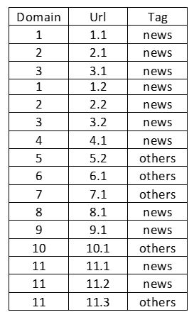
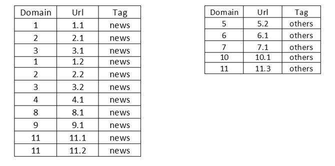
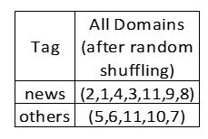
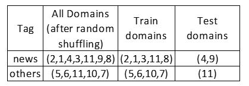
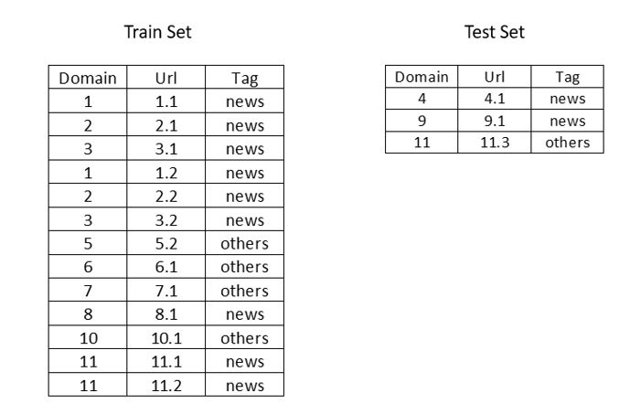

# AV Innoplexus - Webpage Classification

**Hiring Hackathon : Webpage Classification** 

Website: https://datahack.analyticsvidhya.com/contest/innoplexus-online-hiring-hackathon-ai-challenge/ 

## Tags

Classification 

## Description

## Problem Statement

Classification of Web page content is vital to many tasks in Web information retrieval such as maintaining Web directories and focused crawling. The uncontrolled nature of Web content presents additional challenges to Web page classification as compared to traditional text classification, however the interconnected nature of hypertext also provides features that can assist the process.

Here the task is to classify the web pages to the respective classes it belongs to, in a single label classification setup (Each webpage can belong to only 1 class).

Basically given the complete html and url, predict the tag a web page belongs to out of 9 predefined tags as given below:

  1) People profile

  2) Conferences/Congress

  3) Forums

  4) News article

  5) Clinical trials

  6) Publication

  7) Thesis

  8) Guidelines

  9) Others

### Data Dictionary

train.zip contains 2 csvs

1. **train.csv**: Train set

   | **Variable** | **Definition**                       |
   | ------------ | ------------------------------------ |
   | Webpage_id   | Unique ID for the Web page           |
   | Domain       | Domain                               |
   | Url          | Complete Url                         |
   | Tag          | (Target) Tag (Class) of the Web page |

   

2. **html_data.csv:** Contains web page data in HTML for both train and test web pages

   | **Variable** | **Definition**             |
   | ------------ | -------------------------- |
   | Webpage_id   | Unique ID for the Web page |
   | Html         | Web page data in HTML      |

   

**test.csv:** Test Set

| **Variable** | **Definition**             |
| ------------ | -------------------------- |
| Webpage_id   | Unique ID for the Web page |
| Domain       | Domain                     |
| Url          | Complete Url               |

 

**sample_submission.csv:** Submission format

| **Variable** | **Definition**                       |
| ------------ | ------------------------------------ |
| Webpage_id   | Unique ID for the Web page           |
| Tag          | (Target) Tag (Class) of the Web page |

## **Train-Test Split** 

The tr­­ain and test data split is done based on 

Domain-Tag combination

. For example, suppose we want to split the following sample of 16 URLs into train and test set.

 

 

- First the overall dataset is split into subsets by Tag as shown below:

   

- Now for each subset(Tag) we store all unique domains and randomly shuffle them, so in this case lets say we have:

 

- Next, every third domain (3rd, 6th, 9th and so on) in the all domain sequence is assigned to the test and the rest (1st, 2nd, 4th, 5th, 7th and so on) are assigned to train as shown in the following table:

  

- Final train and test set would be:

 

## **Evaluation Metric**

The evaluation metric for this competition is weighted F1 score.

 

## **Public and Private Split**

Test data is further randomly divided into Public (40%) and Private (60%) data.

- Your initial responses will be checked and scored on the Public data.
- The final rankings would be based on your private score which will be published once the competition is over.

### Innoplexus Hackathon Rules

1. Entries submitted after the contest is closed will not be considered.
2. Since this is a hiring hack, you are expected to solve the problem on your own.
3. Use of external dataset is strictly prohibited.
4. Use of Webpage_id as a feature is not allowed.
5. Participation is free-of-charge.
6. Participant must update their profile details and upload their latest CV.

### User Privacy

The profile of the user as updated at time of registering for the contest along with their CV and Analytics Vidhya profile will be shared with the sponsor of the hackathon for purposes of hiring.

### Solution Checker

1. You are free to use solution checker as many times as you want.
2. Adding comments is mandatory for the use of solution checker
3. Comments will help you to refer to a particular solution at a later point in time.

### Final Submission

1. Setting final submission is mandatory. Without a final submission, your entry will not be considered.
2. Code file is mandatory while sending final submission. For GUI based tools, please upload a zip file of snapshots of steps taken by you, else upload code file.
3. The code file uploaded should be pertaining to your final submission.

### Rules of Conduct

1. Throughout the hackathon, you are expected to respect fellow hackers and act with high integrity.
2. Slack Live Chat admins hold the right to block any participant found to use foul / disrespectful language.
3. Analytics Vidhya and Innoplexus hold the right to disqualify any participant at any stage of competition, if participant(s) are deemed to be acting fraudulently. 

### How to make a submission?

[Video](https://youtu.be/uhAqZTRP9zY)

### How to set a Final Submission?

[Video](https://youtu.be/QiLs6dmwL2g)

------

## Data

**Note :- The datasets in this competitions is solely meant to be used for this competition only. You cannot use it for any other purpose.**

